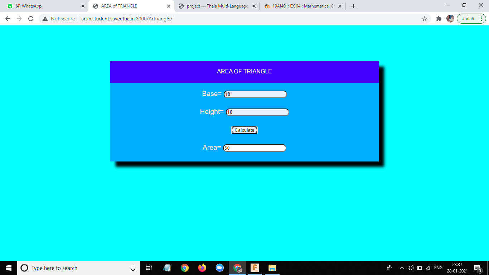

# Mathematical Calculations using JavaScript
## AIM:
To design a website to calculate the area of a circle and volume of a cylinder using JavaScript.

## DESIGN STEPS:
### Step 1: 
Requirement collection.
### Step 2:
Creating the layout using HTML and CSS.
### Step 3:
Write JavaScript to perform calculations.
### Step 4:
Choose the appropriate style and color scheme.
### Step 5:
Validate the layout in various browsers.
### Step 6:
Validate the HTML code.
### Step 6:
Publish the website in the given URL.

## PROGRAM:

### cylinder.html
~~~

<!DOCTYPE html>
<html lang="en">

<head>
    <title>VOLUME OF THE CYLINDER</title>
    <link rel="stylesheet" href="">
</head>

<body>
    

        

            

                VOLUME OF THE CYLINDER
            

            

                <form action="" method="GET">
                    
                    

                        <label for="value_a">BASE=</label>
                        <input type="text" name="value_a" id="value_a">
                    

                    

                        <label for="value_b">HEIGHT=</label>
                        <input type="text" name="value_b" id="value_b">
                    
                    
                    

                        <button type="button" name="button_add" id="button_add">CALCULATE</button>
                    

                    

                        <label for="value_c">RESULT=</label>
                        <input type="text" name="value_c" id="value_c" readonly>
                    
                   
                </form>
            

        

    

    
</body>

</html>
~~~
### Artriangle.html
~~~

<!DOCTYPE html>
<html lang="en">

<head>
    <title>AREA of TRIANGLE</title>
    <link rel="stylesheet" href="">
</head>

<body>
    

        

            

                AREA OF TRIANGLE
            

            

                <form action="" method="GET">
                    
                    

                        <label for="value_b">Base=</label>
                        <input type="text" name="value_b" id="value_b">
                    

                    

                        <label for="value_h">Height=</label>
                        <input type="text" name="value_h" id="value_h">
                    
                    
                    

                        <button type="button" name="button_calculate" id="button_calculate">Calculate</button>
                    

                    

                        <label for="value_c">Area=</label>
                        <input type="text" name="value_c" id="value_c" readonly>
                    

                </form>
            

        

    

    
</body>
</html>
~~~
### cylinder.js
~~~
result_button = document.querySelector('#button_add');

result_button.addEventListener('click', function(e){
    txta = document.querySelector('#value_a');
    txtb = document.querySelector('#value_b');
    txtc = document.querySelector('#value_c');
    
    let c;

    c = 22/7 * parseFloat(txta.value**2) * parseFloat(txtb.value);

    txtc.value = c;

});

~~~
### mathscript.js
~~~
button_calculate = document.querySelector('#button_calculate');

button_calculate.addEventListener('click', function(e){
    txtb = document.querySelector('#value_b');
    txth = document.querySelector('#value_h');
    txtc = document.querySelector('#value_c');
    
    let c;

    c = 1/2* parseFloat(txtb.value) * parseFloat(txth.value);

    txtc.value = c;

});
~~~

### Artriangle.css
~~~
*{
      box-sizing: border-box;
      font-family: Arial, Helvetica, sans-serif;
      color: antiquewhite;
}

body, html{
    margin-top: 0px;
    margin-right: 0px;
    margin-bottom: 0px;
    margin-left: 0px;
    padding-top: 0px;
    padding-right: 0px;
    padding-bottom: 0px;
    padding-left: 0px;
    background-color: rgb(5, 255, 255);
}

.container{
    width: 750px;
    margin-left: auto;
    margin-right: auto;
    box-shadow: 15px 15px 8px black;
}

.formview{
    justify-content: center;
    margin-top: 100px; 
}

.forminput{
    height: 50px;
    padding-top: 20px;
    font-size: larger;
}

.banner{
    display: block;
    width: 100%;
    background-color: rgb(68, 0, 255);
    padding-top: 20px;
    text-align: center;
    height: 60px;
}

.content{
    display: block;
    width: 100%;
    background-color: rgb(0, 174, 255);
    text-align: center;
    padding-bottom: 20px;
}

input{
    color: #4E3C14;
    border-radius: 0.5cm;
}
button{
    color: #4E3C14;
    border-radius: 0.5cm;
}
~~~

## OUTPUT:

## validator:

## RESULT:
Thus a website is designed to calculate Area of triangle and Volume of cylinder and is hosted in the URL http://arun.student.saveetha.in:8000/Artriangle/ and http://arun.student.saveetha.in:8000/cylinder/ . HTML code is validated.